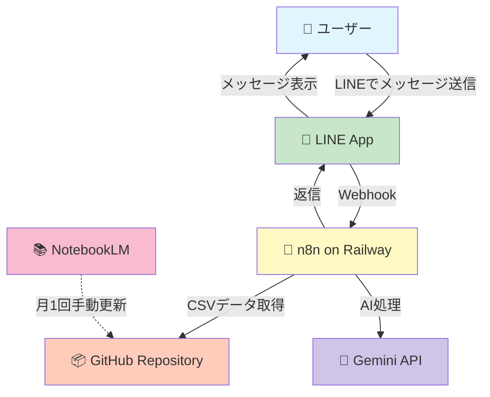
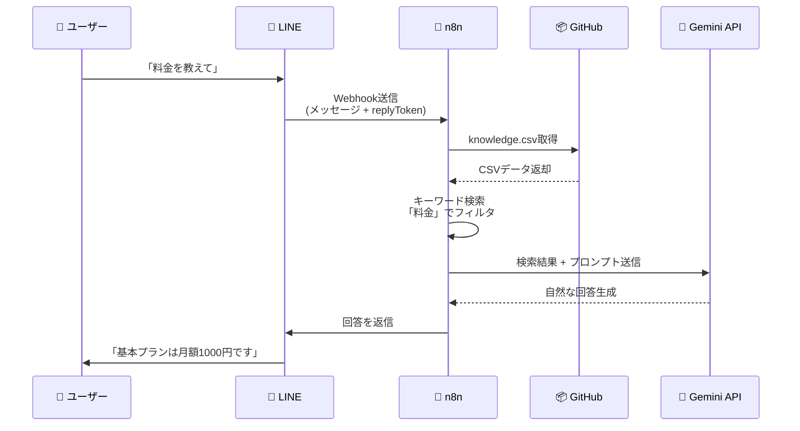
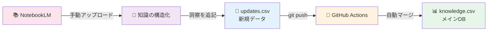
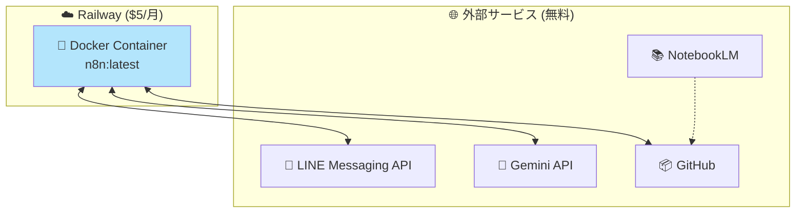
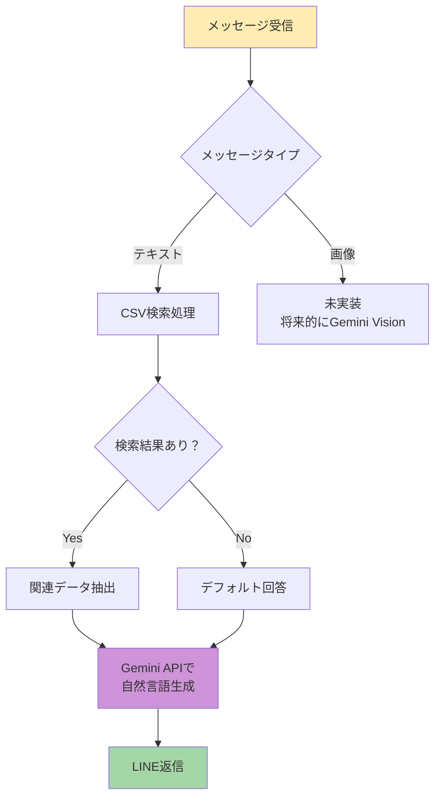
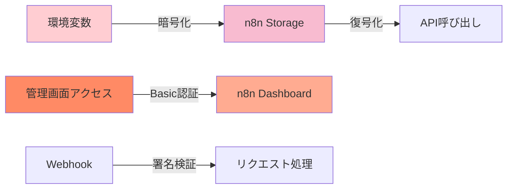
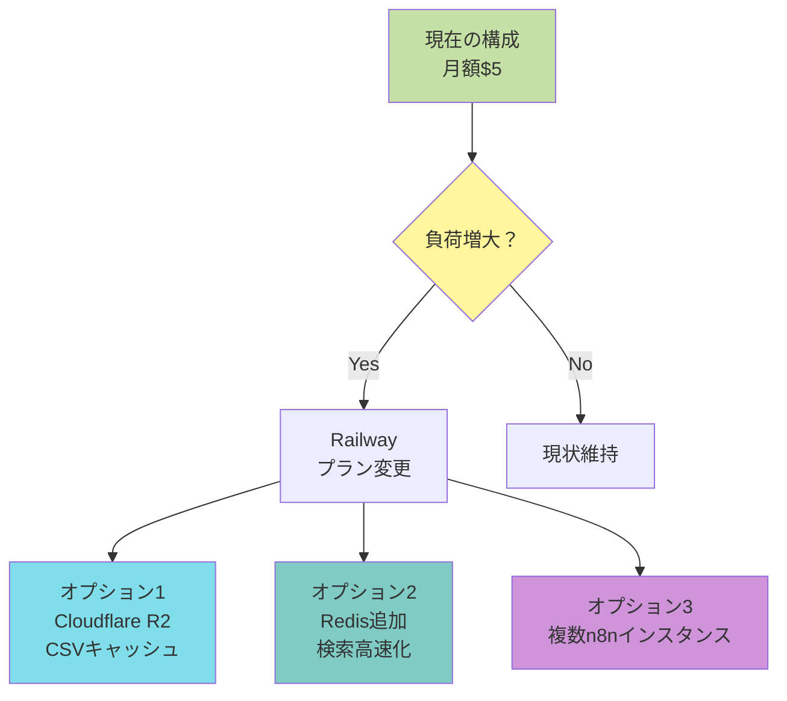
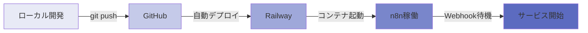

# 📱 KnowledgeLink アプリケーション動作フロー

## 🔄 システム全体の流れ

## 📊 詳細な処理フロー

## 🗂️ データ管理フロー

## 🏗️ インフラ構成

## 💬 メッセージ処理の詳細

## 🔐 セキュリティフロー

## 📈 スケーリング戦略

## 🎯 主要コンポーネントの役割

| コンポーネント | 役割 | コスト |
|--------------|------|--------|
| 🔧 n8n | ワークフロー実行エンジン | Railway $5/月 |
| 📦 GitHub | データストレージ・バージョン管理 | 無料 |
| 🤖 Gemini API | 自然言語処理・回答生成 | 無料（60 QPM） |
| 📱 LINE API | メッセージング基盤 | 無料 |
| 📚 NotebookLM | 知識の構造化・洞察生成 | 無料 |

## 🚀 デプロイメントフロー

