# 📱 KnowledgeLink アプリケーション動作フロー

## 🔄 システム全体の流れ

```mermaid
graph TB
    A[👤 ユーザー] -->|LINEでメッセージ送信| B[📱 LINE App]
    B -->|Webhook| C[🔧 n8n on Railway]
    C -->|CSVデータ取得| D[📦 GitHub Repository]
    C -->|AI処理| E[🤖 Gemini API]
    C -->|返信| B
    B -->|メッセージ表示| A
    
    F[📚 NotebookLM] -.->|月1回手動更新| D
    
```

## 📊 詳細な処理フロー

```mermaid
sequenceDiagram
    participant U as 👤 ユーザー
    participant L as 📱 LINE
    participant N as 🔧 n8n
    participant G as 📦 GitHub
    participant AI as 🤖 Gemini API
    
    U->>L: 「料金を教えて」
    L->>N: Webhook送信<br/>(メッセージ + replyToken)
    N->>G: knowledge.csv取得
    G-->>N: CSVデータ返却
    N->>N: キーワード検索<br/>「料金」でフィルタ
    N->>AI: 検索結果 + プロンプト送信
    AI-->>N: 自然な回答生成
    N->>L: 回答を返信
    L->>U: 「基本プランは月額1000円です」
```

## 🗂️ データ管理フロー

```mermaid
graph LR
    A[📝 updates.csv<br/>新規データ] -->|git push| B[🔄 GitHub Actions]
    B -->|自動マージ| C[📊 knowledge.csv<br/>メインDB]
    
    D[📚 NotebookLM] -->|手動アップロード| E[🧠 知識の構造化]
    E -->|洞察を追記| A
    
```

## 🏗️ インフラ構成

```mermaid
graph TB
    subgraph "☁️ Railway ($5/月)"
        A[🐳 Docker Container<br/>n8n:latest]
    end
    
    subgraph "🌐 外部サービス (無料)"
        B[📱 LINE Messaging API]
        C[🤖 Gemini API]
        D[📦 GitHub]
        E[📚 NotebookLM]
    end
    
    A <--> B
    A <--> C
    A <--> D
    E -.-> D
```

## 💬 メッセージ処理の詳細

```mermaid
flowchart TD
    A[メッセージ受信] --> B{メッセージタイプ}
    B -->|テキスト| C[CSV検索処理]
    B -->|画像| D[未実装<br/>将来的にGemini Vision]
    
    C --> E{検索結果あり？}
    E -->|Yes| F[関連データ抽出]
    E -->|No| G[デフォルト回答]
    
    F --> H[Gemini APIで<br/>自然言語生成]
    G --> H
    H --> I[LINE返信]
```

## 🔐 セキュリティフロー

```mermaid
graph LR
    A[環境変数] -->|暗号化| B[n8n Storage]
    B -->|復号化| C[API呼び出し]
    
    D[管理画面アクセス] -->|Basic認証| E[n8n Dashboard]
    
    F[Webhook] -->|署名検証| G[リクエスト処理]
```

## 📈 スケーリング戦略

```mermaid
graph TD
    A[現在の構成<br/>月額$5] --> B{負荷増大？}
    B -->|Yes| C[Railway<br/>プラン変更]
    B -->|No| D[現状維持]
    
    C --> E[オプション1<br/>Cloudflare R2<br/>CSVキャッシュ]
    C --> F[オプション2<br/>Redis追加<br/>検索高速化]
    C --> G[オプション3<br/>複数n8nインスタンス]
```

## 🎯 主要コンポーネントの役割

| コンポーネント | 役割 | コスト |
|--------------|------|--------|
| 🔧 n8n | ワークフロー実行エンジン | Railway $5/月 |
| 📦 GitHub | データストレージ・バージョン管理 | 無料 |
| 🤖 Gemini API | 自然言語処理・回答生成 | 無料（60 QPM） |
| 📱 LINE API | メッセージング基盤 | 無料 |
| 📚 NotebookLM | 知識の構造化・洞察生成 | 無料 |

## 🚀 デプロイメントフロー

```mermaid
graph LR
    A[ローカル開発] -->|git push| B[GitHub]
    B -->|自動デプロイ| C[Railway]
    C -->|コンテナ起動| D[n8n稼働]
    D -->|Webhook待機| E[サービス開始]
```

