# 📱 KnowledgeLink アプリケーション動作フロー

## 🔄 システム全体の流れ

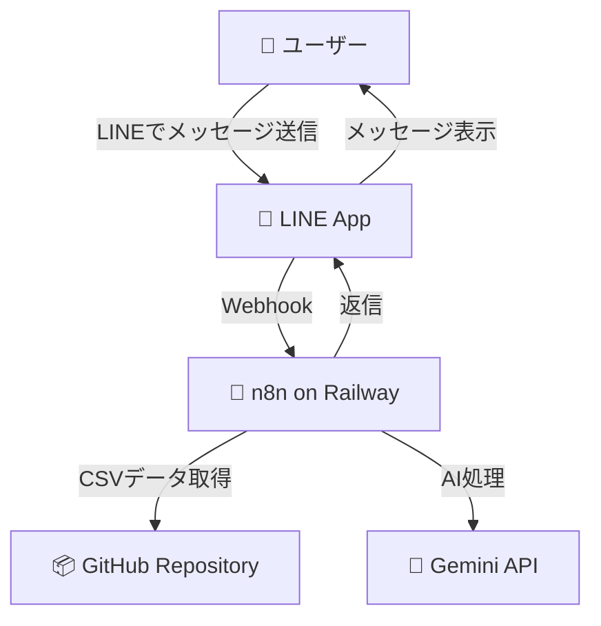

## 📊 詳細な処理フロー

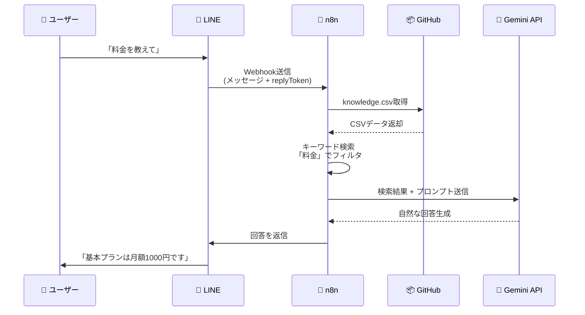

## 🗂️ データ管理フロー

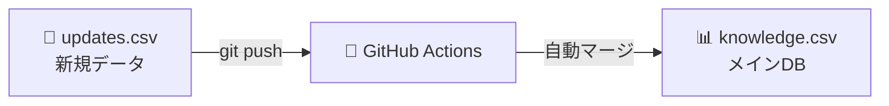

## 🏗️ インフラ構成

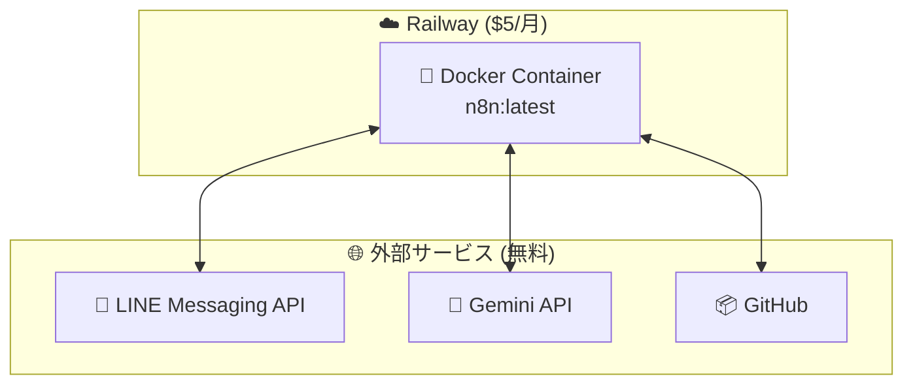

## 💬 メッセージ処理の詳細

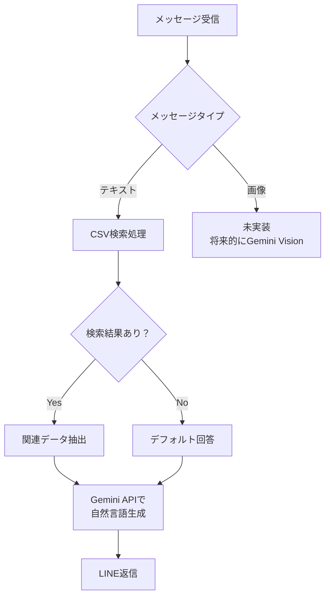

## 🔐 セキュリティフロー

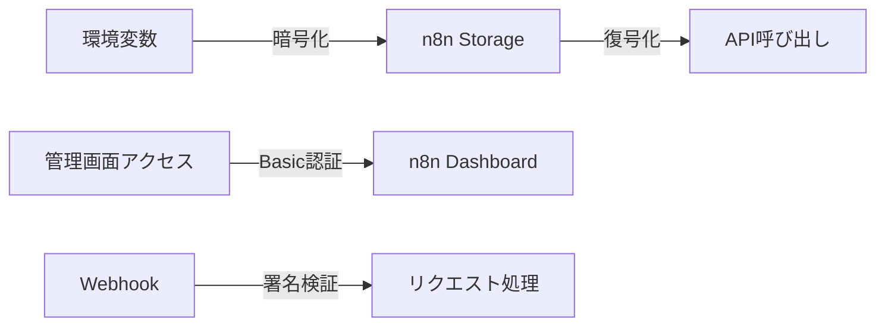

## 📈 スケーリング戦略

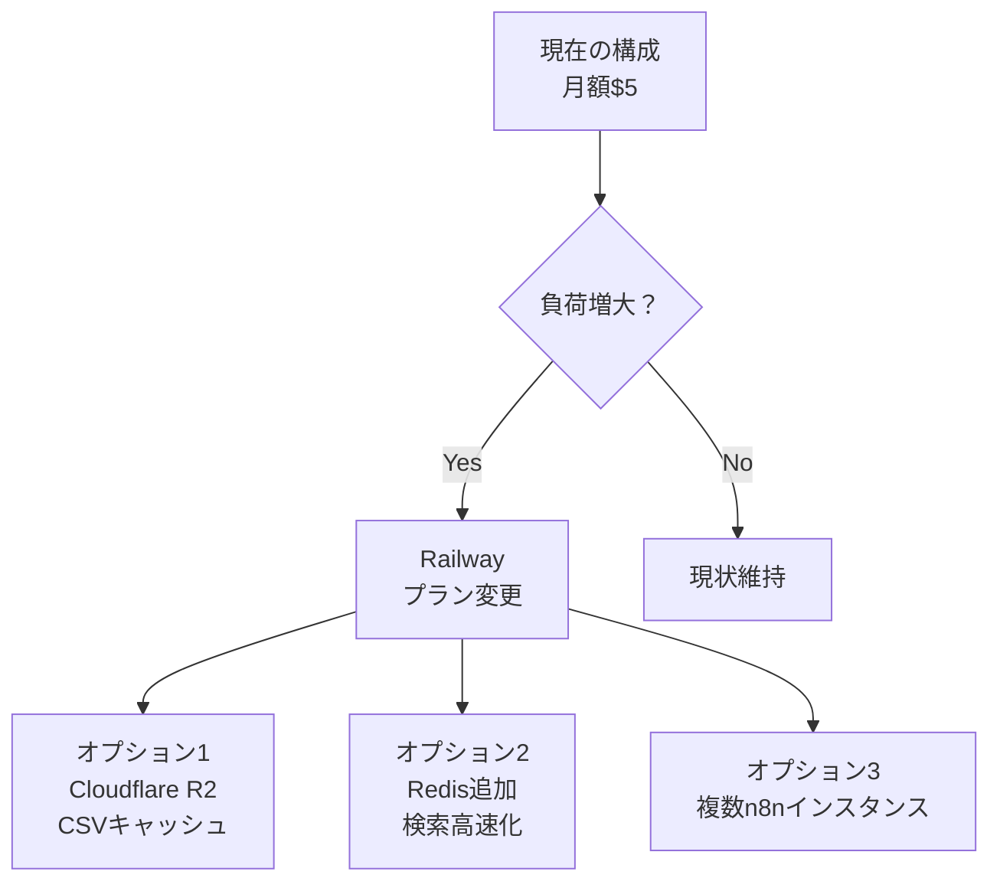

## 🎯 主要コンポーネントの役割

| コンポーネント | 役割 | コスト |
|--------------|------|--------|
| 🔧 n8n | ワークフロー実行エンジン | Railway $5/月 |
| 📦 GitHub | データストレージ・バージョン管理 | 無料 |
| 🤖 Gemini API | 自然言語処理・回答生成 | 無料（60 QPM） |
| 📱 LINE API | メッセージング基盤 | 無料 |

## 🚀 デプロイメントフロー

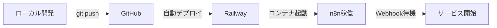

## 💰 より安くする方法

### 🤔 そもそも「AI検索」は必要？

**答え: 大量データなら必要です！**

もし5000件以上のデータ（ブログ記事、メール、PDF等）を扱うなら、AI検索が必要になります。

#### 📖 例え話
- **キーワード検索** = 辞書の索引で探すようなもの → 10件程度ならOK
- **AI検索（ベクトル検索）** = Google検索のように「意味」を理解して探す → 1000件以上なら必須

あなたのCSVは5139行もあるので、AI検索を検討すべきです。

### 選択肢1: 今のままをちょっと改善（月約650円）【🎯 おすすめ！】
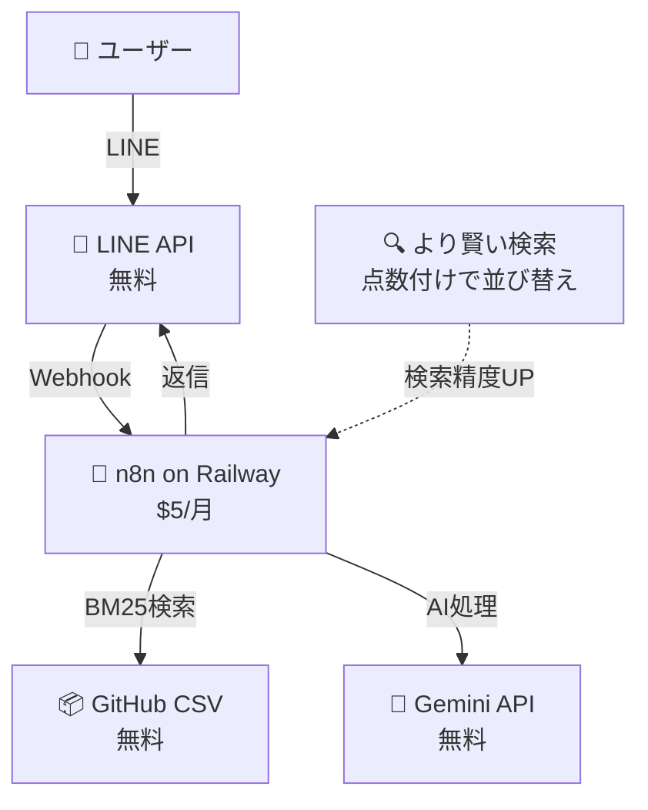

### 選択肢2: AI検索を追加（月約650円）【✅ 大量データには必須】
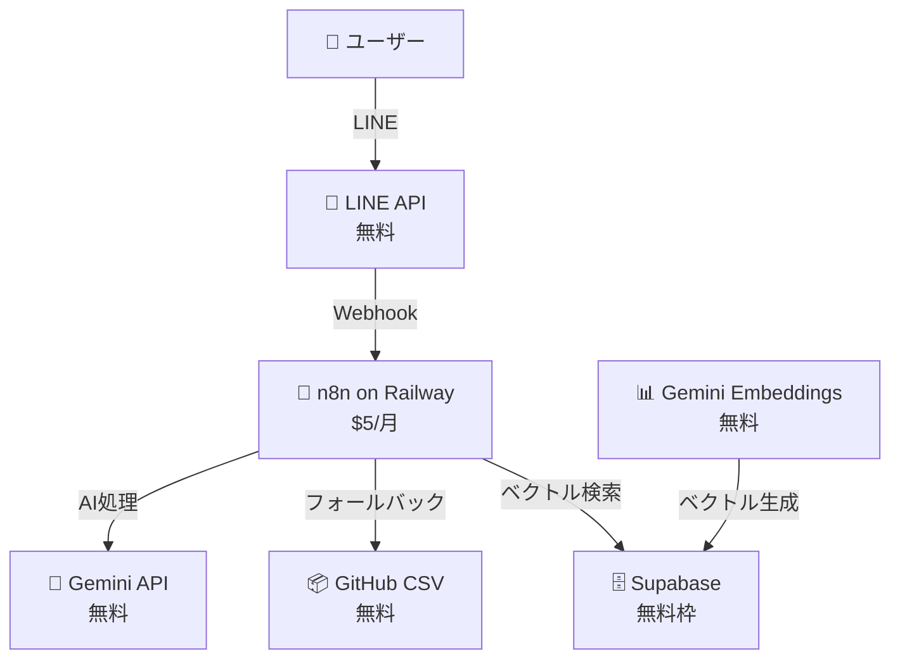

### 選択肢3: 完全無料にする（月額0円）【🔧 技術者向け】
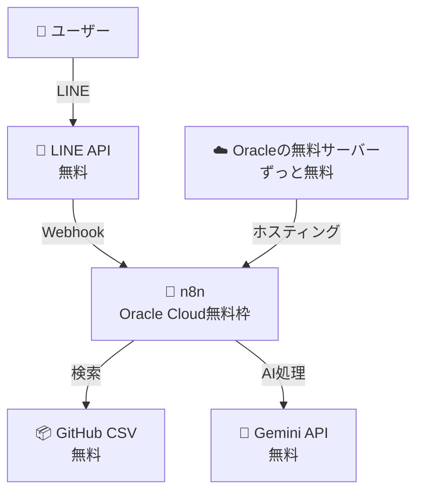

### 🔍 実現可能性をチェックしました

| 確認したこと | 結果 | わかりやすく説明 |
|------|----------|--------|
| AI検索用データベース | ✅ 無料枠あり | ただし設定が難しい |
| Oracleの無料サーバー | ✅ ずっと無料 | でも自分で全部管理が必要 |
| 賢い検索アルゴリズム | ✅ 実装可能 | 1日でできる！ |
| GoogleのAIエンベディング | ✅ 1日1500回無料 | ただし遅くなる |

## 📈 ステップバイステップで進める方法


### 📊 3つの選択肢を比べてみましょう

| 比べること | 選択肢1（おすすめ） | 選択肢2 | 選択肢3 |
|------|------------|------------|------------|
| 月の費用 | 650円 | 650円 | 0円 |
| 作る難しさ | 簡単（1日） | 普通（1週間） | 難しい（2週間以上） |
| 検索の賢さ | そこそこ | とても賢い | 普通 |
| 管理の楽さ | 楽 | 普通 | 大変（全部自分で） |
| 将来性 | ○ | ◎ | △ |

### 💡 賢い検索の作り方（選択肢1）

今の検索はこんな感じです：
```
ユーザー: 「料金」
システム: キーワードに「料金」があるか確認 → あった！
```

これをもっと賢くします：
```
ユーザー: 「おいくらですか？」
システム: 
1. 「おいくら」→「料金」に似てる？ → 5点
2. 「価格」キーワードも確認 → 10点  
3. 「費用」キーワードも確認 → 10点

合計25点の質問が1位に！
```

こんな感じで「点数」をつけて、一番良さそうな答えを選びます。