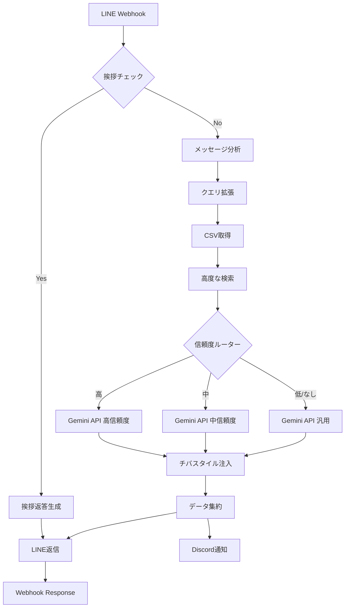

# n8n Ultimate ワークフローの最強機能

## 🚀 実装された機能一覧

### 1. **挨拶自動判定と専用ルート**
- 「こんにちは」「おはよう」などを自動検出
- チバらしい元気な挨拶を即座に返信
- メイン処理をスキップして高速レスポンス

### 2. **メッセージ分析エンジン**
- **クエリタイプ分類**
  - keyword: 短い単語検索
  - question: 疑問形の質問
  - consultation: 相談形式
- **緊急度検出**: 「今すぐ」「急いで」を認識
- **場所検出**: 渋谷、新宿、恵比寿などを自動抽出

### 3. **類義語展開システム**
- ナンパ → 声かけ、アプローチ、ストナン
- 女性 → 女の子、女子、レディ
- 完全な類義語辞書による検索精度向上

### 4. **高度な検索アルゴリズム**
- **マルチスコアリング**
  - カテゴリマッチ: 20点
  - 質問マッチ: 15点
  - キーワードマッチ: 10点
  - 回答マッチ: 5点
- **コンテキストボーナス**
  - 場所が一致: +10点
  - 緊急度高: ×1.5倍
- **重複削除と上位10件抽出**

### 5. **信頼度ベースの分岐処理**
```
高信頼度（30点以上）→ 詳細な回答
中信頼度（10-29点）→ 一般的アドバイス含む
低信頼度（10点未満）→ 汎用回答
結果なし → お詫び＋一般論
```

### 6. **Gemini API の賢い使い分け**
- 信頼度に応じて異なるプロンプト
- 参考情報の表示量を調整
- チバの性格を維持した回答生成

### 7. **チバスタイル注入ノード**
- カスタムノードによる文体変換
- クエリタイプに応じた強度調整
- 「ガンガン」「ドンドン」の自動挿入

### 8. **並列処理**
- LINE返信とDiscord通知を同時実行
- エラー時も止まらない設計

### 9. **エラーハンドリング**
- 各APIのエラーをキャッチ
- エラーログ記録
- フォールバック処理

### 10. **拡張性**
- Discord通知（オプション）
- Slack連携可能
- データベース保存可能
- A/Bテスト可能

## 📊 処理フロー



## 🎯 この設計の利点

1. **視覚的な条件分岐** - 処理の流れが一目瞭然
2. **モジュール化** - 各機能が独立して管理可能
3. **簡単な機能追加** - ノードを追加するだけ
4. **A/Bテスト可能** - ルーターで振り分け
5. **リアルタイムデバッグ** - 各ノードの出力を確認可能

## 🔧 カスタマイズ例

### 新機能追加が簡単
- **Slackへも通知したい** → Slackノード追加
- **データベースに保存** → PostgreSQLノード追加
- **画像対応** → 画像判定ノード追加
- **多言語対応** → 言語検出ノード追加

### 条件追加も視覚的
- **時間帯で回答を変える** → 時間判定ノード追加
- **ユーザー履歴を参照** → DBルックアップノード追加
- **スパム判定** → フィルターノード追加

これがn8nの真の力です！コードを書かずに、ドラッグ&ドロップで高度な処理が実装できます。