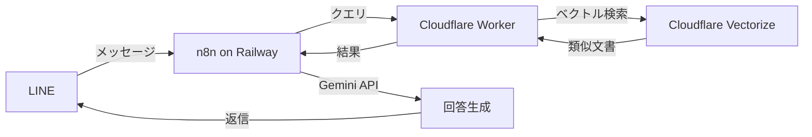

# n8n RAG実装ガイド（Cloudflare Vectorize編）

## 🏗️ アーキテクチャ



## 📝 実装手順

### 1. Cloudflare Worker セットアップ

```javascript
// worker.js
export default {
  async fetch(request, env) {
    const { pathname } = new URL(request.url);
    
    if (pathname === '/embed') {
      // テキストをベクトル化
      const { text } = await request.json();
      const embedding = await getEmbedding(text);
      
      // Vectorizeに保存
      await env.VECTORIZE_INDEX.insert([{
        id: crypto.randomUUID(),
        values: embedding,
        metadata: { text }
      }]);
      
      return Response.json({ success: true });
    }
    
    if (pathname === '/search') {
      // ベクトル検索
      const { query, topK = 5 } = await request.json();
      const queryEmbedding = await getEmbedding(query);
      
      const results = await env.VECTORIZE_INDEX.query(
        queryEmbedding,
        { topK }
      );
      
      return Response.json({ results });
    }
  }
};

async function getEmbedding(text) {
  // Gemini APIでエンベディング生成
  const response = await fetch('https://generativelanguage.googleapis.com/v1/models/text-embedding-004:embedContent', {
    method: 'POST',
    headers: {
      'Content-Type': 'application/json',
      'x-goog-api-key': env.GEMINI_API_KEY
    },
    body: JSON.stringify({
      model: 'models/text-embedding-004',
      content: { parts: [{ text }] }
    })
  });
  
  const data = await response.json();
  return data.embedding.values;
}
```

### 2. n8n ワークフロー

```json
{
  "name": "LINE RAG Chatbot",
  "nodes": [
    {
      "name": "LINE Webhook",
      "type": "n8n-nodes-base.webhook",
      "parameters": {
        "path": "line-webhook",
        "responseMode": "lastNode"
      }
    },
    {
      "name": "Search Vector DB",
      "type": "n8n-nodes-base.httpRequest",
      "parameters": {
        "method": "POST",
        "url": "https://your-worker.workers.dev/search",
        "body": {
          "query": "={{ $json.events[0].message.text }}",
          "topK": 3
        }
      }
    },
    {
      "name": "Generate Answer",
      "type": "n8n-nodes-base.httpRequest",
      "parameters": {
        "method": "POST",
        "url": "https://generativelanguage.googleapis.com/v1beta/models/gemini-pro:generateContent",
        "headers": {
          "x-goog-api-key": "YOUR_GEMINI_KEY"
        },
        "body": {
          "contents": [{
            "parts": [{
              "text": "以下の情報を基に質問に答えてください。\n\n情報:\n{{ $json.results }}\n\n質問: {{ $('LINE Webhook').item.json.events[0].message.text }}"
            }]
          }]
        }
      }
    },
    {
      "name": "Reply to LINE",
      "type": "n8n-nodes-base.httpRequest",
      "parameters": {
        "method": "POST",
        "url": "https://api.line.me/v2/bot/message/reply",
        "headers": {
          "Authorization": "Bearer YOUR_LINE_TOKEN"
        },
        "body": {
          "replyToken": "={{ $('LINE Webhook').item.json.events[0].replyToken }}",
          "messages": [{
            "type": "text",
            "text": "={{ $json.candidates[0].content.parts[0].text }}"
          }]
        }
      }
    }
  ]
}
```

## 🚀 データ投入スクリプト

```javascript
// upload-data.js
const fs = require('fs');
const csv = require('csv-parser');

async function uploadToVectorize() {
  const results = [];
  
  fs.createReadStream('your-data.csv')
    .pipe(csv())
    .on('data', (data) => results.push(data))
    .on('end', async () => {
      for (const row of results) {
        const text = `${row.question} ${row.answer} ${row.keywords}`;
        
        await fetch('https://your-worker.workers.dev/embed', {
          method: 'POST',
          headers: { 'Content-Type': 'application/json' },
          body: JSON.stringify({ text })
        });
        
        console.log(`Uploaded: ${row.id}`);
      }
    });
}
```

## 💰 コスト計算

5000件のデータの場合：
- エンベディング生成: 無料（Gemini）
- ベクトル保存: $0.05/100M次元
- 検索クエリ: $0.01/1M次元
- **月額見込み: $5（Workers）+ $0.50（Vector）= 約$5.50**

## 🎯 パフォーマンス最適化

1. **バッチ処理**: 複数のエンベディングを一括生成
2. **キャッシュ**: 頻出クエリの結果をKVに保存
3. **インデックス最適化**: メタデータでフィルタリング

## ⚡ Upstash Vector 代替実装

```javascript
// Upstash版（よりシンプル）
const vectorDB = new UpstashVector({
  url: "YOUR_UPSTASH_URL",
  token: "YOUR_UPSTASH_TOKEN"
});

// 検索
const results = await vectorDB.query({
  vector: embedding,
  topK: 5,
  includeMetadata: true
});
```